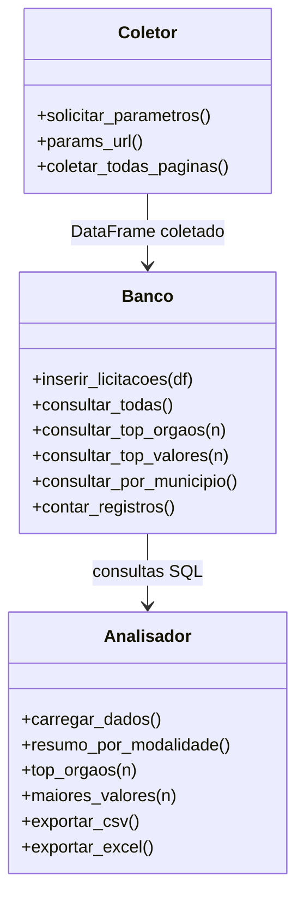

# Arquitetura

## Estrutura de arquivos

```
pipeline-pncp/
├── main.py          → menu principal e fluxo
├── coletor.py       → coleta via API + paginação
├── banco.py         → CRUD com SQLite
├── analisador.py    → consultas SQL + pandas + exportação
└── dados/
    └── pncp.db      → banco SQLite
```

## Fluxo de dados

```
API PNCP → Coletor → pd.json_normalize() → Banco (SQLite) → Analisador → Output
```

## Diagrama de classes



## Paginação

A API limita 50 registros por requisição. O loop usa `paginasRestantes` da resposta:

```
Requisição página 1 → paginasRestantes: 39
Requisição página 2 → paginasRestantes: 38
...
Requisição página 40 → paginasRestantes: 0 → break
```

## Normalização do JSON

Os dados chegam com dicionários aninhados (`orgaoEntidade`, `unidadeOrgao`). O `pd.json_normalize()` os achata em colunas:

```
orgaoEntidade.razaoSocial  →  orgaoEntidade_razaoSocial
unidadeOrgao.municipioNome →  unidadeOrgao_municipioNome
```

## Schema do banco

```sql
CREATE TABLE IF NOT EXISTS licitacoes (
    numeroControlePNCP TEXT PRIMARY KEY,
    modalidadeNome TEXT,
    objetoCompra TEXT,
    valorTotalEstimado REAL,
    valorTotalHomologado REAL,
    dataPublicacaoPncp TEXT,
    orgaoEntidade_razaoSocial TEXT,
    unidadeOrgao_municipioNome TEXT,
    unidadeOrgao_ufSigla TEXT,
    situacaoCompraNome TEXT
);
```

## Consultas SQL principais

```sql
-- Top 10 órgãos que mais licitaram
SELECT orgaoEntidade_razaoSocial, COUNT(*) as total, SUM(valorTotalEstimado) as valor_total
FROM licitacoes
GROUP BY orgaoEntidade_razaoSocial
ORDER BY total DESC
LIMIT 10;

-- Maiores valores por licitação
SELECT objetoCompra, valorTotalEstimado, orgaoEntidade_razaoSocial
FROM licitacoes
WHERE valorTotalEstimado > 0
ORDER BY valorTotalEstimado DESC
LIMIT 10;

-- Distribuição por município
SELECT unidadeOrgao_municipioNome, COUNT(*) as total
FROM licitacoes
GROUP BY unidadeOrgao_municipioNome
ORDER BY total DESC;

-- Filtro por período
SELECT * FROM licitacoes
WHERE dataPublicacaoPncp BETWEEN '2025-01-01' AND '2025-06-30';
```

Ver também: [ADRs](./adr/README.md) para o raciocínio por trás dessas escolhas.
