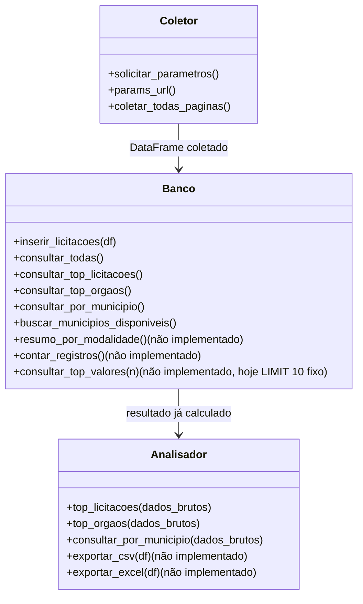

# Arquitetura

## Versões

v1 (atual): Coletor + Banco fazem extração e carga. Power BI faz a análise, conectado direto no SQLite via ODBC.
v2 (pausada, revisão em 2026-08-08): Analisador + main.py retomam o ETL completo em Python, com Streamlit no lugar do terminal. Código já existe, descrito abaixo.

## Estrutura de arquivos

```
pipeline-pncp/
├── main.py          → menu principal e fluxo (v2)
├── coletor.py       → coleta via API + paginação (v1)
├── banco.py         → CRUD + consultas SQL (carga é v1, consultas de negócio são v2)
├── analisador.py    → formatação + exportação (v2)
├── utils.py         → funções auxiliares reutilizáveis
└── dados/
    └── pncp.db      → banco SQLite
```

## Fluxo de dados

v1: `API PNCP → Coletor → pd.json_normalize() → Banco (SQLite) → Power BI (ODBC) → Dashboard`
v2: `API PNCP → Coletor → pd.json_normalize() → Banco (SQL) → Analisador (formata/exporta) → Output`

## Divisão de responsabilidade — Banco vs Analisador (v2)

Consultas complexas (agrupamentos, rankings, filtros) são feitas via SQL dentro do Banco, não recalculadas em pandas dentro do Analisador. O SQLite já otimiza `GROUP BY`/`ORDER BY` internamente, sem precisar carregar todas as linhas pra memória antes de agrupar.

```
Banco       → executa a query SQL pesada e devolve o resultado já resumido
Analisador  → recebe o resultado pronto, decide como apresentar, não recalcula nada
```

Na v1 essa divisão não existe: o Power BI lê a tabela bruta e agrega sozinho (Power Query/DAX).

## Diagrama de classes (v2)



## Utils

```python
def empty(df): # Verifica se o DataFrame está vazio e retorna True/False
    return df.empty
```

## Paginação

A API limita registros por requisição conforme `tamanhoPagina`. O loop usa `paginasRestantes` da resposta:

```
Requisição página 1 → paginasRestantes: 39
Requisição página 2 → paginasRestantes: 38
...
Requisição página 40 → paginasRestantes: 0 → break
```

## Normalização do JSON

`pd.json_normalize()` achata `orgaoEntidade`/`unidadeOrgao` usando ponto como separador (`sep="."`, o padrão da função):

```
orgaoEntidade.razaoSocial
unidadeOrgao.municipioNome
unidadeOrgao.nomeUnidade
```

Nota: esse documento antes descrevia o separador como underscore. Conferido no schema real via Power BI — é ponto, e o `banco.py` já usava certo.

## Schema do banco

`criar_tabela()` não é chamada no fluxo atual. A tabela é criada pelo `df.to_sql(if_exists="replace")`, com colunas inferidas do DataFrame achatado — o schema real depende do que a API devolver naquela coleta, não do CREATE TABLE abaixo (versão manual, nunca usada, mantida só de referência):

```sql
CREATE TABLE IF NOT EXISTS licitacoes (
    "anoCompra" INTEGER NOT NULL,
    "dataInclusao" TEXT NOT NULL,
    "dataPublicacaoPncp" TEXT NOT NULL,
    "dataAtualizacao" TEXT NOT NULL,
    "dataAberturaProposta" TEXT NOT NULL,
    "dataEncerramentoProposta" TEXT NOT NULL,
    "objetoCompra" TEXT NOT NULL,
    "valorTotalEstimado" REAL,
    "valorTotalHomologado" REAL,
    "orgaoEntidade.cnpj" TEXT NOT NULL,
    "orgaoEntidade.razaoSocial" TEXT NOT NULL,
    "orgaoEntidade.esferaId" TEXT NOT NULL,
    "situacaoCompraNome" TEXT NOT NULL,
    "modalidadeNome" TEXT NOT NULL
);
```

Colunas confirmadas no schema real (via Power BI): `valorTotalHomologado`, `dataAtualizacaoGlobal`, `linkProcessoEletronico`, `emendaParlamentar`, `numeroControlePNCP`, `modoDisputaId`, `modalidadeId`, `valorTotalEstimado`, `situacaoCompraNome`, `usuarioNome`, `orgaoEntidade.cnpj`, `orgaoEntidade.razaoSocial`, `orgaoEntidade.poderId`, `orgaoEntidade.esferaId`, `unidadeOrgao.ufNome`, `unidadeOrgao.codigoUnidade`, `unidadeOrgao.nomeUnidade`.

## Consultas SQL principais (v2)

```sql
-- Top 10 licitações por valor estimado (Banco.consultar_top_licitacoes)
SELECT processo, "unidadeOrgao.nomeUnidade", valorTotalEstimado, valorTotalHomologado, "unidadeOrgao.municipioNome"
FROM licitacoes
ORDER BY valorTotalEstimado DESC
LIMIT 10;

-- Top 10 órgãos por valor estimado (Banco.consultar_top_orgaos)
SELECT processo, "unidadeOrgao.nomeUnidade", valorTotalEstimado, valorTotalHomologado, "unidadeOrgao.municipioNome"
FROM licitacoes
GROUP BY "unidadeOrgao.nomeUnidade"
ORDER BY valorTotalEstimado DESC
LIMIT 10;

-- Consulta por município (Banco.consultar_por_municipio)
SELECT "unidadeOrgao.nomeUnidade", valorTotalEstimado, valorTotalHomologado, "unidadeOrgao.municipioNome"
FROM licitacoes
WHERE "unidadeOrgao.municipioNome" = ? AND valorTotalEstimado != 0 AND valorTotalHomologado != 0
ORDER BY valorTotalEstimado DESC;
```

Bug conhecido (v2): `consultar_top_orgaos` faz `GROUP BY "unidadeOrgao.nomeUnidade"` mas seleciona colunas não agregadas — SQL válido no SQLite, mas retorna linha arbitrária por grupo, não o top de fato. Precisa de `SUM()`/`MAX()` ou reestruturar a query. Não afeta a v1: o Power BI agrega a tabela bruta e não permite essa ambiguidade.
git s
Ver também: [ADRs](./adr/README.md).
